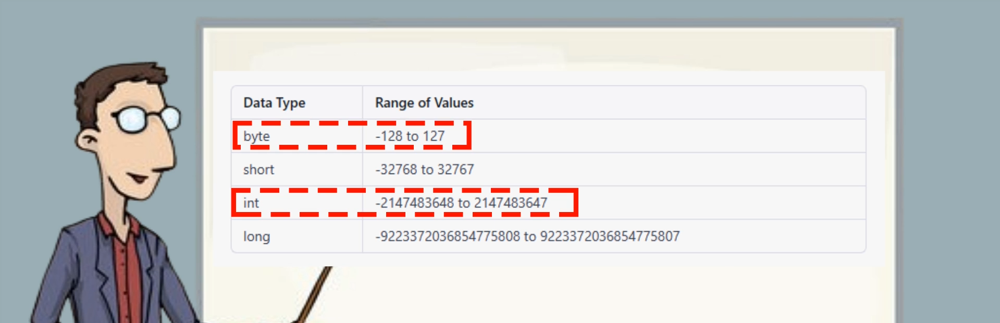
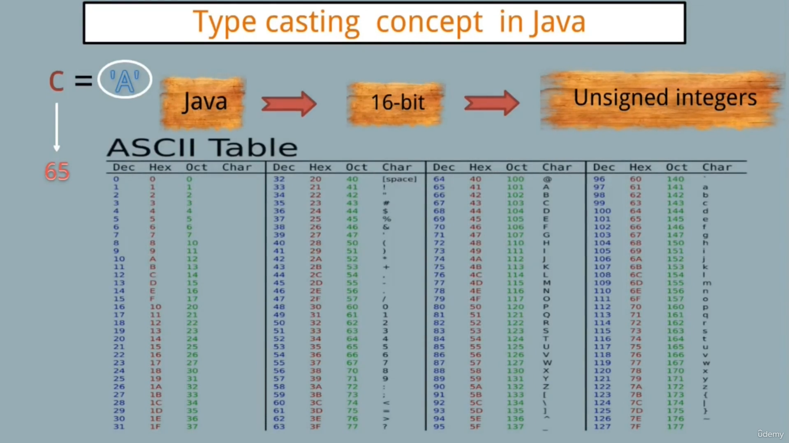
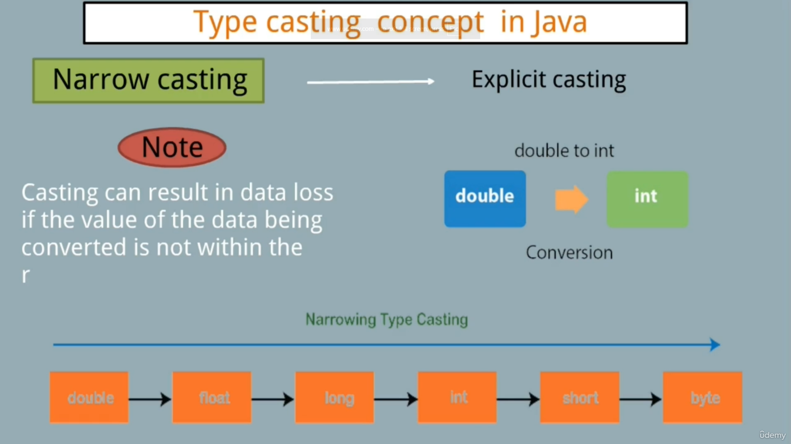

## Primitive Data Types Examples


### Byte Example

```java
byte x = 10;
byte y = 20;
int sum = x + y;
System.out.println(sum);
System.out.println("        10 + 20");
System.out.println("           30");
```

Output:
```
30
    10 + 20
       30
```



### ASCII Example

```java
char letter = 'A';
int asciiValue = (int) letter;
System.out.println("The ASCII value of '" + letter + "' is " + asciiValue);
```

Output:
```
The ASCII value of 'A' is 65
```



