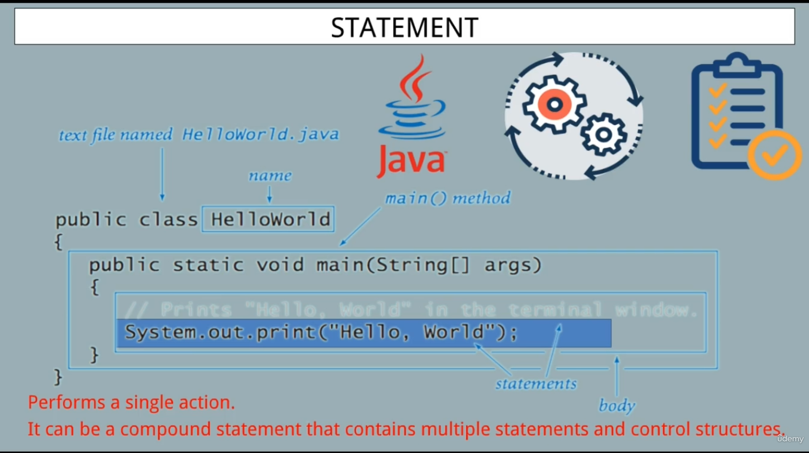

# Statements in Java

Types of Statements :

1. Expression statements
2. Declaration statements
3. Control statements

Expression statements :

Contain an expression ( variables, operators, method )

Followed by a semicolon

Example: int age = 25;

Declaration statements

That declare a new variable, field or method.

Specifies the data type and name of the entity being declared

**Declaration**: Create a variable with a data type but not assign it a value **(int age;)**

**Defination**: Assign it value **( int age = 25;)**

Control Statements

Control the flow of execution

**"if" statements, "while" loops, "for" loops.**

Block  Statements 

Enclosed in curly braces

Contain multiple statements and declarations