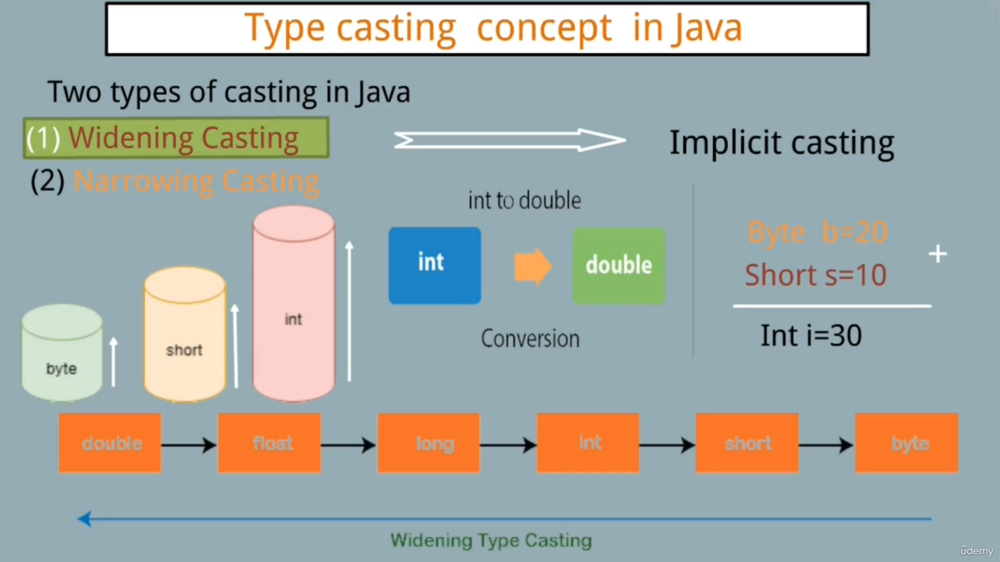

# Type Casting in Java

Java supports two main types of type casting:

1. **Widening Casting (Automatic)**  
    Converts a smaller data type to a larger one without data loss.  
    Example: Implicit casting from `int` to `double`.  
    ```java
    byte b = 20;
    short s = 10;
    int i = 30;
    ```  
    (See the image: )

2. **Narrowing Casting (Explicit)**  
    Converts a larger data type to a smaller one, requiring manual casting and potentially losing data.
