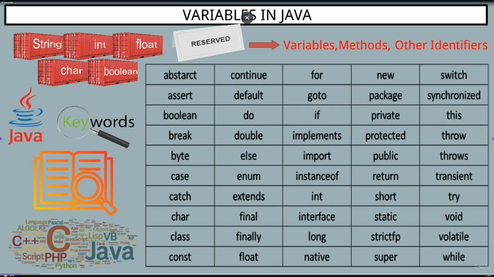
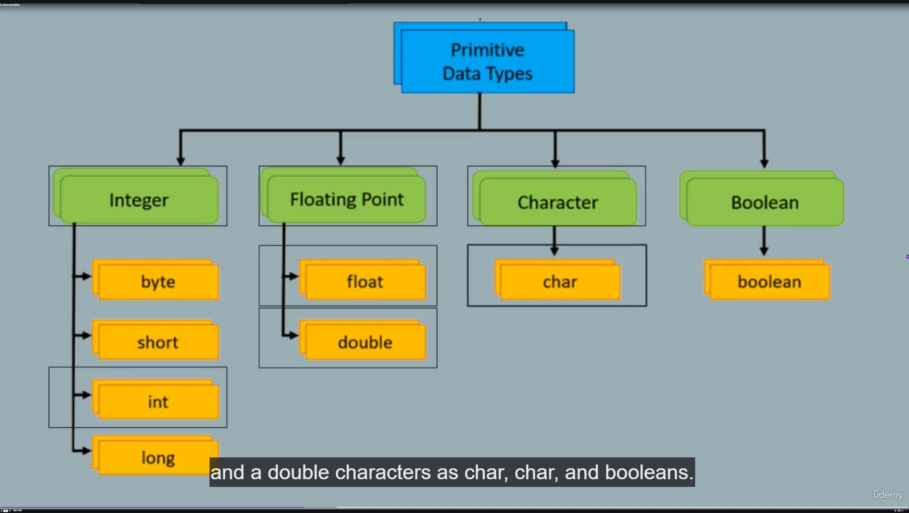

# Variables in Java

Keywords are also case-sensitive:

int ≠ Int / INT

Types Of Keywords :

Primitive data types : **(BASIC TYPES)**

**int**

**double**

**char**

Control Statements 

**if**

**else**

**while**

Modifiers : **( KEYWORD )**

**private**

**public**

**final**

**this**

**super**

**null**

